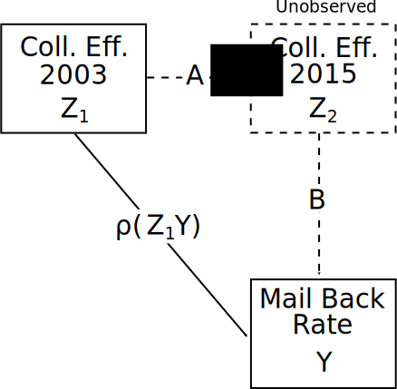
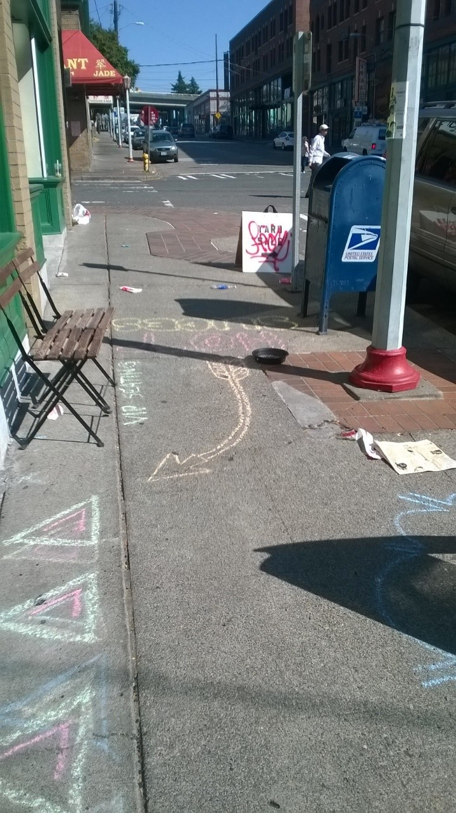

```{r setup, include=FALSE}
options(htmltools.dir.version = FALSE)
library(dplyr)
library(ggplot2)
library(extrafont)
```


# Outline

1. Theoretical Framework

2. Project Structure

3. Experiments

   * Lost Letter
   * Mailbox Experiment
   
4. Summary

---
class: inverse

# Theoretical Framework 

### Neighborhood social control and crime

???

Our focus crime

Crime always has risks

Prosocial action does not always have risk but risk is an underappreciated element

---

# Broken Windows

[Wilson & Kelling (1982)](https://www.theatlantic.com/magazine/archive/1982/03/broken-windows/304465/) describe a system where community disorder (1) increases crime by 
signalling low social control to offenders and (2) decreases actual social control by reducing willingness to use public spaces.
--

.pull-left60[


]

.pull-right40[
* A: Disorder signals low guardianship which increases offending.

* B, E: Disorder and crime constrain social relations and impede control.

* C, D: Social control inhibits both disorder and crime.
]

.centernote[
*This model is under-identified without instruments, manipulations, or repeated observations.*
]

---

# Collective Efficacy

[Sampson & Raudenbush (1999)](https://doi.org/10.1086/210356) contend that disorder and crime are both manifestations of low collective efficacy—the community's capacity for informal social control.
--

.pull-left60[

]

.pull-right40[
* C, D: Disorder and crime are products of low collective efficacy—social control—which is exogenous (B, E).

* A: Disorder has no direct impact on crime.
]

.centernote[
*A, B, and E represent testable constraints on Broken Windows.*
]

---
# Our Review

Adjudicating between these models is difficult—[see our review for a discussion](https://doi.org/10.1146/annurev-criminol-011419-041541).

.image-75[

]

---
class: inverse
# Key Study

### [Keizer, Lindenberg, & Steg (2008)](https://doi.org/10.1126/science.1161405)

---
## Keizer, Lindenberg, & Steg (2008)

Keizer et al. used disorder manipulations and recorded norm violation with field experiments in Grongingen, the Netherlands. 

Multiple interventions show a consistent positive relationship with norm violation.
--

.pull-left[


]

.pull-right[
* Powerful causal effect of disorder on multiple forms of norm violation (A).

* Single sites in one city: No examination of context, indirect pathways, or reciprocal effects.
]

*Can these be replicated in other locations? What is the influence of context?*

---
class: inverse
# Research Design

---
# Objectives

Our overall objective is to examine the links in the causal diagram.

We approach this with field experiments embedded in neighborhoods with rich contextual data from the 2003 Seattle Neighborhoods and Crime Survey.

--

Today I focus on two interventions:

* Replicating Keizer et al. (2008) in Seattle neighborhoods

* Using the lost letter method to update collective efficacy

---
# Experiment Diagram


???

Paths E and C are hard to isolate

Can't use crime as an intervention

Crime is a rare event to observe

Sanctioning is difficult intervention

---

```{r, echo=FALSE, message=FALSE, cache=TRUE, warning=FALSE, dev='svg', out.width='78%'}
ttf_import("./fonts")
exp_df <- expand.grid(year = 2014:2017,
                      experiment = c("Lost Letter", "Mailbox", "Litter\nIntervention", "Litter\nClean-Up")) %>%
  mutate(active = case_when(
    experiment=="Mailbox" & year==2014 ~ 1,
    experiment=="Mailbox" & year==2015 ~ 1,    
    experiment=="Mailbox" & year==2016 ~ 1,
    experiment=="Mailbox" & year==2017 ~ 1,
    experiment=="Lost Letter" & year==2015 ~ 2,
    experiment=="Lost Letter" & year==2016 ~ 1,
    experiment=="Litter\nIntervention" & year==2017 ~ 1,
    experiment=="Litter\nClean-Up" & year==2016 ~ 2,
    experiment=="Litter\nClean-Up" & year==2017 ~ 1,
    TRUE ~ as.numeric(NA)
  ), trials = case_when(
    experiment=="Mailbox" & year==2014 ~ 132,
    experiment=="Mailbox" & year==2015 ~ 41,    
    experiment=="Mailbox" & year==2016 ~ 104,
    experiment=="Mailbox" & year==2017 ~ 128,
    experiment=="Lost Letter" & year==2015 ~ 432,
    experiment=="Lost Letter" & year==2016 ~ 2938,
    experiment=="Litter\nIntervention" & year==2017 ~ 576,
    experiment=="Litter\nClean-Up" & year==2016 ~ 6,
    experiment=="Litter\nClean-Up" & year==2017 ~ 21,
    TRUE ~ as.numeric(NA)
)) %>%
  mutate(experiment = forcats::fct_relevel(experiment, "Litter\nClean-Up", "Litter\nIntervention", "Mailbox", "Lost Letter"))

ggplot(exp_df, aes(x=year, y=experiment, fill=factor(active))) + 
  xlab("") + ylab("") + ggtitle("Experiment Timeline", subtitle= "Number of trials") + 
  geom_tile(color="white") + 
    geom_text(size=8, color="#cbd3a3", hjust=0.5, aes(label=trials), family = "Quattrocento") +
  scale_fill_manual(values=c("2" = "#458490", "1" = "#342c5c", "0" = "white")) +
  theme_minimal(base_size=21, base_family = "Quattrocento") + 
  theme(legend.position = "none", axis.text.x = element_text(angle=45, hjust=1),
        axis.text.y = element_text(hjust = 0.5),
        panel.grid = element_blank())
```

---

```{r, echo=FALSE, warning=FALSE, message=FALSE, cache=TRUE, results='hide', dev="svg", fig.height=6.15}
library(ggmap)
library(sp)
library(sf)
library(stringr)
library(maptools)

`%!in%` <- Negate(`%in%`) 
load("./data/WA_tract_2010.RData")
load("./data/lost_letter_tract_122117.RData")

letter_tracts <- c("00100", "01000", "10100", "10200", "10300", "10500", "10600", 
                   "10800", "10900", "01100", "11101", "11102", "11200", "11300", 
                   "11500", "11600", "11700", "11800", "11900", "01200", "12000", 
                   "12100", "01300", "01400", "01500", "01600", "01800", "01900", 
                   "00200", "02000", "02100", "02200", "02400", "02500", "02600", 
                   "02700", "02800", "02900", "00300", "03000", "03100", "03200", 
                   "03300", "03400", "03500", "03600", "03800", "03900", "04000", 
                   "00401", "00402", "04100", "04200", "04400", "04500", "04600", 
                   "04700", "04800", "04900", "00500", "05000", "05100", "05200", 
                   "05301", "05400", "05600", "05700", "05801", "05802", "05900", 
                   "00600", "06000", "06100", "06200", "06300", "06400", "06500", 
                   "06600", "06700", "06800", "06900", "00700", "07000", "07100", 
                   "07200", "07300", "07500", "07600", "07700", "07800", "07900", 
                   "00800", "08001", "08002", "08100", "08200", "08300", "08400", 
                   "08500", "08600", "08700", "08800", "08900", "00900", "09000", 
                   "09100", "09200", "09400", "09500", "09600", "09701", "09702", 
                   "09800", "09900", "10001", "10401", "10701", "11001", "11401", 
                   "01701", "04301", "07401", "10002", "10402", "10702", "11002", 
                   "11402", "01702", "04302", "07402")

mailbox_tracts <- c("02700", "08900", "09200", "06800", "07500", "09100", "02800", 
                   "00100", "10002", "10300", "10402", "10600", "02600", "05600", 
                   "06100", "06300", "07402", "07800", "09000", "09701")
  
littering_tracts <- c("00100", "01701", "02600", "04700", "06800", "07100", "07500", 
                      "08900", "09100", "09701", "10402", "11402")

KC_tract_2010 <- elide(WA_tract_2010[WA_tract_2010@data$COUNTYFP10=="033",], rotate=-16)
seattle_tracts <- st_as_sf(KC_tract_2010[as.numeric(str_sub(KC_tract_2010@data$GISJOIN, -5,-1)) %in% 100:12100, "GISJOIN"]) %>%
  mutate(tract = str_sub(GISJOIN, -5,-1)) %>%
  mutate(mailbox = tract %in% mailbox_tracts,
         littering = tract %in% littering_tracts,
         lost_letter = tract %in% letter_tracts) %>%
  mutate(Experiment = case_when(
    mailbox==TRUE & littering==TRUE ~ "Mailbox, Litter Intervention",
    mailbox==TRUE ~ "Mailbox",
    littering==TRUE ~ "Litter Intervention",
    lost_letter==FALSE ~ "No Letters",
    TRUE ~ "Only Letters"
  )) %>%
  mutate(Experiment = forcats::fct_relevel(Experiment, "Mailbox, Litter Intervention", "Mailbox", "Litter Intervention", "Only Letters", "No Letters"))

ggplot(seattle_tracts, aes(fill=Experiment)) + geom_sf(size=0.1, aes(color=Experiment)) + coord_sf(datum=NA) +
  scale_fill_manual(values = c("Mailbox, Litter Intervention"="#342c5c", "Mailbox"="#458490", "Litter Intervention"="#905145", "No Letters"="grey", "Only Letters"="#cbd3a3")) +
  scale_color_manual(values = c("Mailbox, Litter Intervention"="white", "Mailbox"="white", "Litter Intervention"="white", "No Letters"="white", "Only Letters"="white")) +
  theme_minimal(base_size = 20, base_family = "Quattrocento")
# ggsave("./Presentations/SocSem_102618/img/experiment_map.svg")
```

---
class: inverse
# The Experiments

---
# Lost Letter: Method

Replication of [Milgram et al. (1965)](https://doi.org/10.1086/267344) and [Sampson (2012)](https://www.press.uchicago.edu/ucp/books/book/chicago/G/bo5514383.html).

--

2,938 letters were dropped on Seattle sidewalks for passersby to encounter.

--

24 letters—8 per addressee—were dropped in each census tract:
  * Charles F. Landers Sr. (Personal)
  * Friends of Black Lives Matter (BLM)
  * American Neo-Nazi Party (Nazi)

--

Mailed letters were received at a PO Box monitored by the research team.

--

Letters were geocoded to drop locations.

---
# Lost Letter: Results


| *Study* (Letter Address)         | *Return Rate* | $\rho(CE)$ 
|:--------------------------------|--------|------------|
|*Milgram et al. (1965)*<sup>1</sup>         |        |            |
| &nbsp;&nbsp; Medical Research Associates    | 70%    |    --      |
| &nbsp;&nbsp; Friends of the Community Party | 70%    |    --      |
| &nbsp;&nbsp; Friends of the Nazi Party      | 25%    |    --      |
|*Sampson (2012)*<sup>2</sup>                | 33%    |    .41     |
|*SNCP*<sup>3</sup>                          |        |            |
| &nbsp;&nbsp; Charles F. Landers Sr.         | 79%    |    .35     |
| &nbsp;&nbsp; Friends of Black Lives Matter  | 71%    |    .32     |
| &nbsp;&nbsp; American Neo-Nazi Party        | 24%    |    .03     |

* Our results closely mimic Milgram et al. (1965).
* Collective efficacy does not predict Neo-Nazi letter returns.

.footnote[
[1] New Haven, CT<br>
[2] Chicago, IL<br>
[3] Seattle, WA
]
---
# Updating Collective Efficacy

.pull-left[

]

.pull-right[
Empirical estimates:

* Sampson (2012) found $A = .73$ over 7 years.
* Assume $A = .50$ over 12 years.
* We find $\rho(Z_1Y) = .35$ for personal letters.
]

---

# Updating Collective Efficacy

.pull-left[

]

.pull-right[
Empirical estimates:

* Sampson (2012) found $A = .73$ over 7 years.
* Assume $A = .50$ over 12 years.
* We find $\rho(Z_1Y) = .35$ for personal letters.

Extrapolation:

* $\rho(Z_1Y) = A*B$
* $.35 = .50 * B$
* $B = .70$
]

Under some assumptions,

* Collective efficacy is highly correlated with letter returns.
* We have an updated measure of collective efficacy.

---

# Mailbox: Method

.pull-left[
.image-75[

]
]


* A letter containing a visible $5 bill is left near mailbox for passersby to encounter.

--

* Litter and a sign board with graffiti are introduced to manipulate disorder.

--

* Researchers record whether participants mail, steal, or ignore the envelope.<sup>1</sup>

.footnote[[1] Perceived sex, age, and group size of participants were also recorded to adjust for compositional differences of tracts.]

--

* We conducted 405 trials with 3,671 participants in 20 Seattle census tracts.


---

# Mailbox: Model

Objective: Causal test of direct effect of disorder on crime (A).

.image-63[

]


---

# Mailbox: Model

Our Experiment: Tests of causal direct effects of disorder on crime and prosocial behavior.
<br>

.image-75[

]


---

# Mailbox: Results


<table style="width:70%">
  <tr>
    <td style="font-size:115%" colspan="5">Mailbox: Participant Actions</td>
  </tr>
  <tr>
    <th>Condition</th>
    <th>Walk-By</th>
    <th>Mail</th>
    <th>Theft</th>
  </tr>
  <tr>
    <td rowspan="2">Control</td>
    <td>1629</td>
    <td>208</td>
    <td>33</td>
  </tr>
  <tr>
    <td>87.1%</td>
    <td><strong>11.1%</strong></td>
    <td><strong>1.8%</strong></td>
  </tr>
  <tr>
    <td rowspan="2">Treatment</td>
    <td>1637</td>
    <td>136</td>
    <td>28</td>
  </tr>
  <tr>
    <td>90.9%</td>
    <td><strong>7.6%</strong></td>
    <td><strong>1.6%</strong></td>
  </tr>
</table>

Key Findings:

* Disorder has no impact on theft.<sup>1</sup>

.footnote[[1] There is no significant positive relationship in *any* location.]
--

* Disorder reduces the likelihood of mailing—resulting in the letter remaining on the ground longer.

--

* Collective efficacy is associated with lower theft, but not more mailing.

---
class: inverse
# Summary


* No disorder effect on theft (unable to replicate Keizer et al. 2008).

* Disorder attenuates mailing letters--low risk prosocial behavior (mailbox)
   * Perhaps disorder undermines informal social control--as suggested by Broken Windows.
   * *However, disorder had no effect on sanctioning--higher risk prosocial behavior (littering)*

* Context matters for prosocial behavior
   * Letter addresses affect mail back rates (lost letter)
   * *Race / gender of litterer effects sanctioning (littering)*
   
* Collective efficacy is associated with fewer thefts (mailbox)

* Collective efficacy is associated with mailing back letters (lost letter)

---

# Acknowledgements

Our findings are the result of over 2000 person-hours of field work over four summers. This project was made possible by the participation of graduate student researchers, grant funding, and institutional resources on campus.

.pull-left[
### Researchers

Anquinette Barry

Chris Hess

John Leverso

Kate O'Neill

Terrence Pope
]

.pull-right[
### Funding

National Science Foundation

UW Royalty Research Fund

### Support

Center for Statistics and the Social Sciences

Center for Studies in Demography and Ecology
]

---
class:inverse
# Thank you!

---

class:inverse
# Appendices

---

# Sampling

.image-full[

]

---

# Lost Letter Elections


---

# Mailbox Models


.center[Two Mailbox Multinomial Models]

|                    |  Mail    |  Theft   |     Mail  |   Theft  | 
|:------------------:|:--------:|:--------:|:---------:|:--------:|
|  (Intercept)       | **-2.053** | 0.332    | **-1.467**  | -1.437   | 
|                    | *(0.538)*  | *(1.170)*  |  *(0.579)*  | *(1.329)*  | 
|  Treatment       | **-0.275** | -0.081   |**-0.263**   | -0.098   | 
|                    | *(0.118)*  | *(0.261)*  |  *(0.119)*  | *(0.263)*  | 
|  Coll. Eff.          |  0.265   | **-1.206** |   0.171   | -0.804   | 
|                    | *(0.173)*  | *(0.396)*  |  *(0.181)*  | *(0.424)*  |
|  Walk-by Rate   | **-0.564** | -**0.535** |  **-0.534** | **-0.429** | 
|                    | *(0.063)*  | *(0.132)*  |  *(0.064)*  | *(0.133)*  |
|  Male             |          |          |  -0.094   | **0.880**  | 
|                    |          |          | *(0.117)*   | *(0.296)*  |
|  Non-White         |          |          |  **-0.459** | 0.397    |
|                    |          |          | *(0.144)*   | *(0.272)*  |
|  In Group            |          |          |  **-0.876** | **-1.302** |
|                    |          |          | *(0.161)*   | *(0.475)*  | 

???

CE predicts people being in groups

CE predicts fewer men; maybe proxying employment?

---

## Littering Intervention: Method

A confederate walks down the street and flagrantly litters near a trash can in view of passersby.

--

Researchers record whether the confederate is sanctioned—a risky prosocial behavior—or the litter is disposed of by a participant—a low-risk prosocial behavior.

--

Litter and a sign board with graffiti are introduced to manipulate disorder.

--

Replicated with three confederates of varying sex and race to manipulate interpersonal context which may influence evaluations of risk:<sup>1</sup>
   * Black Male
   * White Male
   * White Female

.footnote[[1] Sex and race also interact with normative expectations.]
--

We conducted 576 trials in 12 Seattle census tracts.

---

# Littering Intervention: Model

.pull-left[

]

.pull-right[
* Test of direct effect of disorder on sanctioning (B).
]

---

# Littering Intervention: Model

.pull-left[

]

.pull-right[
* Test of direct effect of disorder on sanctioning (B).

* Norm-Violation is *fixed*—all relationships are conditional on the offense occurring.
]

---

# Littering Intervention: Model

.pull-left[

]

.pull-right[
* Test of direct effect of disorder on sanctioning (B).

* Norm-Violation is *fixed*—all relationships are conditional on the offense occurring.

* Test effect of interpersonal context of norm violation on sanctioning (L).
]

---

# Littering Intervention: Model

.pull-left[

]

.pull-right[
* Test of direct effect of disorder on sanctioning (B).

* Norm-Violation is *fixed*—all relationships are conditional on the offense occurring.

* Test effect of interpersonal context of norm violation on sanctioning (L).

* Captures association between collective efficacy and sanctioning (M).
]

---

# Results: Sanctions

<table style="width:70%">
  <tr>
    <td style="font-size:115%" colspan="5">Litter Intervention: Sanctions</td>
  </tr>
  <tr>
    <th><br>Condition</th>
    <th>Black<br>Male</th>
    <th>White<br>Male</th>
    <th>White<br>Female</th>
    <th><br>All</th>
  </tr>
  <tr>
    <td rowspan="2">Control</td>
    <td>2</td>
    <td>2</td>
    <td>9</td>
    <td>13</td>  
  </tr>
  <tr>
    <td><strong>.021</strong></td>
    <td><strong>.021</strong></td>
    <td><strong>.103</strong></td>
    <td>.045</td>
  </tr>
  <tr>
    <td rowspan="2">Treatment</td>
    <td>1</td>
    <td>8</td>
    <td>4</td>
    <td>13</td> 
  </tr>
  <tr>
    <td><strong>.011</strong></td>
    <td><strong>.091</strong></td>
    <td><strong>.043</strong></td>
    <td>.045</td>
  </tr>
  <tr>
    <td rowspan="2">Both</td>
    <td>3</td>
    <td>10</td>
    <td>13</td>
    <td>26</td>
  </tr>
  <tr>
    <td>.016</td>
    <td>.052</td>
    <td>.068</td>
    <td>.045</td>
  </tr>
</table>

Key Findings:

* No *unconditional* effect of disorder on sanctions—a risky prosocial action.
   * Disorder *interacts* with confederate race/gender.

--
* Collective efficacy and letter returns did not predict sanctioning (M).

--
* Sanctioning varies widely by confederate in both *quantity* and *content*.
   * White female received more *aggressive* sanctions, usually from men.
   * Black male received *passive* sanctions only from women.
   * White male received *balanced* sanctions.

???

LB: 11/13 from men
TP: 3 sanctions from women
CL; 6/10 sanctions from men

---

# Results: Throwing Away


<table style="width:70%">
  <tr>
    <td style="font-size:115%" colspan="5">Litter Intervention: Throw-Aways</td>
  </tr>
  <tr>
    <th><br>Condition</th>
    <th>Black<br>Male</th>
    <th>White<br>Male</th>
    <th>White<br>Female</th>
    <th><br>All</th>
  </tr>
  <tr>
    <td rowspan="2">Control</td>
    <td>3</td>
    <td>7</td>
    <td>7</td>
    <td>17</td>  
  </tr>
  <tr>
    <td><strong>.032</strong></td>
    <td>.079</td>
    <td>.079</td>
    <td><strong>.059</strong></td>
  </tr>
  <tr>
    <td rowspan="2">Treatment</td>
    <td>3</td>
    <td>3</td>
    <td>4</td>
    <td>10</td> 
  </tr>
  <tr>
    <td><strong>.032</strong></td>
    <td>.032</td>
    <td>.043</td>
    <td><strong>.035</strong></td>
  </tr>
  <tr>
    <td rowspan="2">Both</td>
    <td>6</td>
    <td>10</td>
    <td>11</td>
    <td>27</td>
  </tr>
  <tr>
    <td>.032</td>
    <td>.052</td>
    <td>.057</td>
    <td>.047</td>
  </tr>
</table>

We also evaluated if our interventions impacted throwing away the dropped litter—a low risk, non-confrontational prosocial action.

--

Key Findings:

* Disorder treatment reduces throwing away.

    * This effect also conditional on confederate characteristics.
--

* Collective efficacy and letter returns do not predict throwing away.

---

# Litter Clean-Up: Method

.pull-left[
.image-full[

]
]

.pull-right[
* A variety of trash is dropped on a sidewalk.

]

---

# Litter Clean-Up: Method

.pull-left[
.image-full[

]
]

.pull-right[
* A variety of trash is dropped on a sidewalk.

* A magazine rack with concealed camera and motion detector records when the litter is cleaned up and how many people pass by.
]

---

# Litter Clean-Up: Method

.pull-left[
.image-full[

]
]

.pull-right[
* A variety of trash is dropped on a sidewalk.

* A magazine rack with concealed camera and motion detector records when the litter is cleaned up and how many people pass by.
   * This permits capturing the relationship between collective efficacy and time to remove disorder.


]

---

# Litter Clean-Up: Method

.pull-left[
.image-full[

]
]

.pull-right[
* A variety of trash is dropped on a sidewalk.

* A magazine rack with concealed camera and motion detector records when the litter is cleaned up and how many people pass by.
   * This permits capturing the relationship between collective efficacy and time to remove disorder.


* An alternate magazine rack defaced by graffiti and stickers is swapped in to manipulate disorder.
]

---

# Litter Clean-Up: Results

.pull-left[
.image-full[

]
]

* The experiment was abandoned after a small number of trials.

---

# Litter Clean-Up: Results

.pull-left[
.image-full[

]
]

* The experiment was abandoned after a small number of trials.

* In Ravenna, residents reported the magazine racks on Nextdoor as an "eyesore".

--

* Two magazine racks had locks cut and were removed.

--

* Thus we were unable to continue experiment *because of collective efficacy* in an affluent neighborhood.

--

* In contrast, one rack was left *for an entire year* in Capitol Hill without issue.

???

Maybe talk about Coleman and zeal

---

# LitterCam Disorder

.image-full[

]

---

# LitterCam Equipment

.image-full[

]

---

# Litter Clean-Up: Alternative

We supposed the speed of return of lost letters was correlated with clean-up time of trash.


As a pilot, in selected trats, 24 pieces of litter were dropped in the same locations as lost letters and then checked three times over the course of a day.


Neither timing nor a binary measure of clean-up were found to be associated with either lost letter returns or overall collective efficacy.
